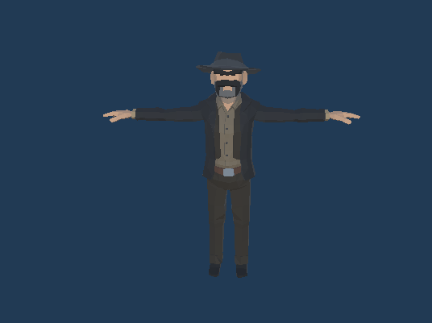
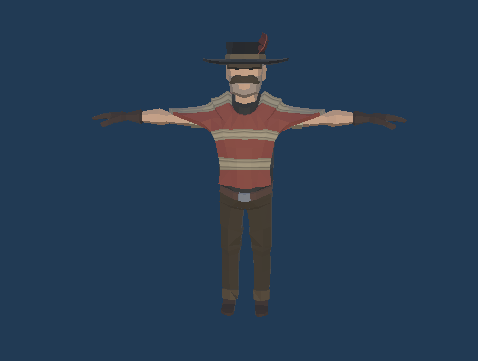
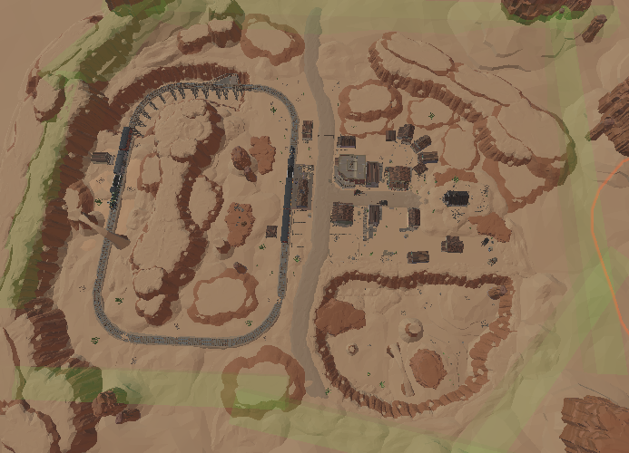
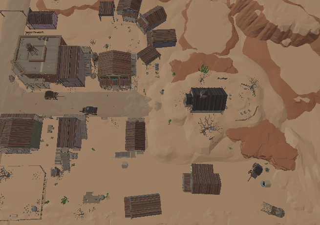
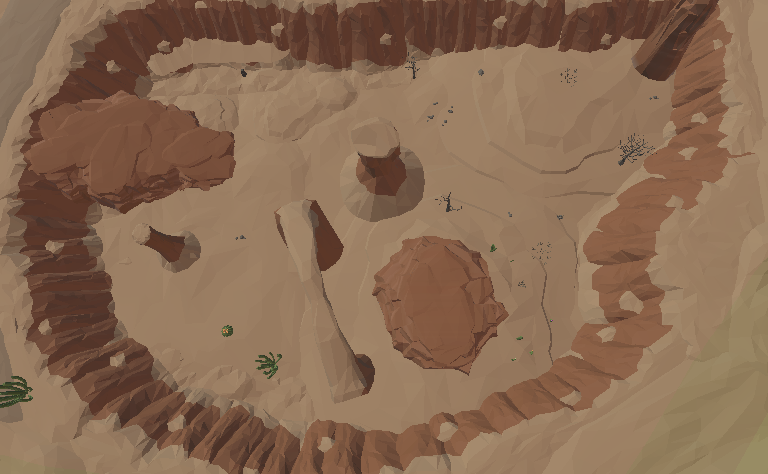
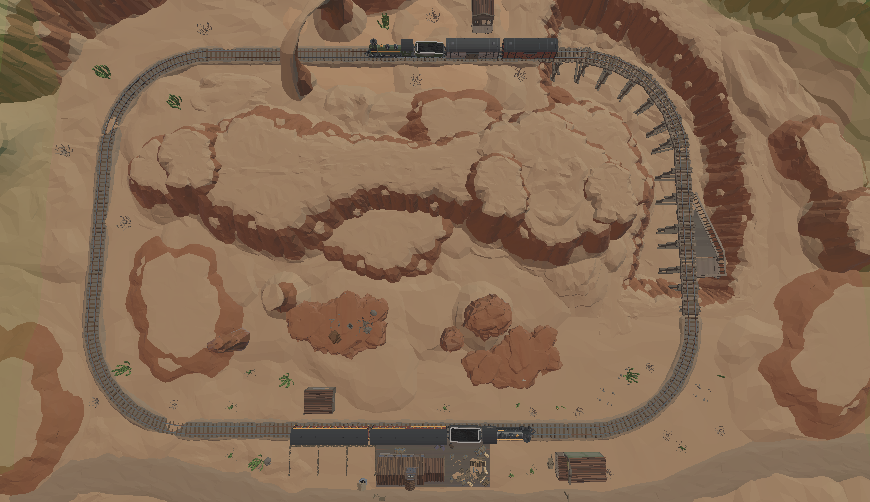

<h1> Saloon Survival - Mobile Top Down Shooter</h1>

<h2> Player Design </h2>

 The main character for the game will be a cowboy with a single pistol trying to survive as long as possible in the wild west, you are the only cowboy left in town with a very big bounty on your head!
 

<h3> Player Input </h3>

 The player can either use gyro, one joystick or two joysticks to traverse the map and shoot the player's weapon. For menu traversal the player can use touch as they usually would. With one joystick or gyro the player will use auto aim at the enemies which shall allow the enemy to focus more on movement than aim. To give the freedom of choice to the user. The variety of input is there so people do not get turned away from the a single control scheme they may not like. It is also great for accessibility as some people may have trouble controlling two joysticks making one joystick or gyro a great option.

<h3> Data Persistence </h3>

 The game shall keep track of your highscore across play sessions as well as whether it is your first time playing so privacy policies and terms of service are not shown every time you open the app 

<h2> Enemy Design </h2>

 I shall have two types of enemy, one with be quicker than the other and the other shall have more health. This is to combat the potential boredom of just fighting one character. In addition this, I do aim to have a propotion of the enemies shooting weapons too, so the enemies can do melee and ranged attacks, yet again to combat potential the game being stagnant. 

<h3> High Health Enemy </h3>

<h3> High Damage Enemy </h3>

<h2> Map Design </h2>

 These are images of the final map. The highlighted green areas are blocking volumes so the character cannot escape the map. I started of by using the demo scene from the asset pack I found. Then fleshed it out to have close areas, areas that only have one way out and spacious areas. This was to keep the game interesting with a reange of high and low intensity areas so the game is not just one pitch throughout. This also allows player to create a playstyle and have some strategy about the movement of their character.

<h2> Framework Design </h2>

<h3> Handsets Gyro ability </h3>
I use the gyro ability of phone to control the player character. The character will use auto aim when in gyro mode so the player only has to focus on movement.

<h3> Unity Analytics </h3>

Unity analytics is used to collect user's game data. This shall consist of how many people are watching an advert to continue, as well as how long users are surviving and how many enemies they are killing in a game session. As well as this Unity collected standard data such as device type, time and the devices operating system. 

<h3> Unity Ads </h3>

 Unity ads is used to monitise the game by showing an advert at the end of a user's play session of the game. In addition to this, player's can watch an advert to get a second life and lengthen their high score by being rewarded with a second life when watching an advert. To not allow exploitation this can only be done one per game loop, so people cannot infinitely watch advert to lengthen their time survived. 

<h3> Google Play Services </h3>

 Google Play Services is used so the game can have achievements and a leaderboard for the top time survived, as well as enemies killed. This is used to give user's something to aim for rather than playing aimlessly. 

